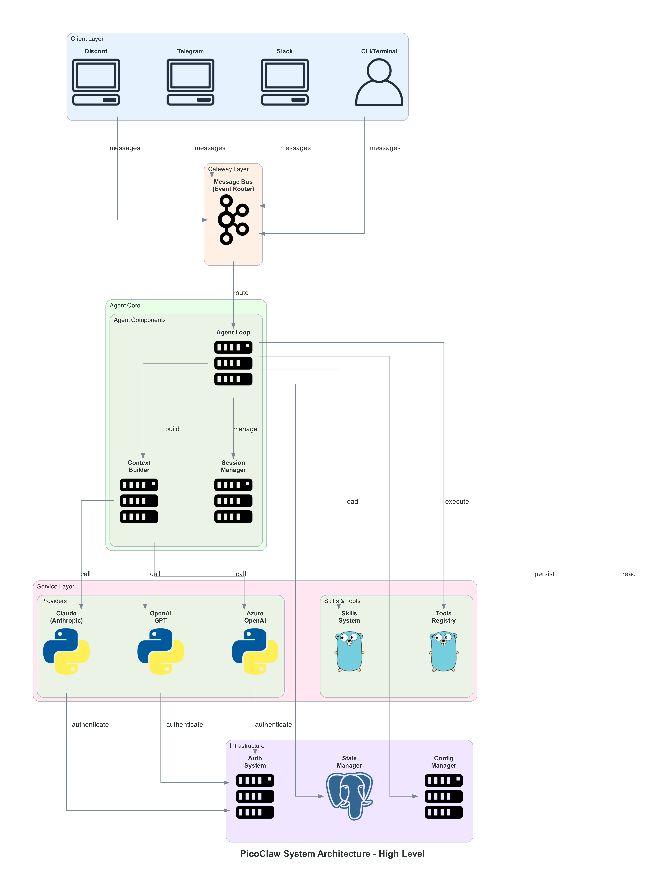
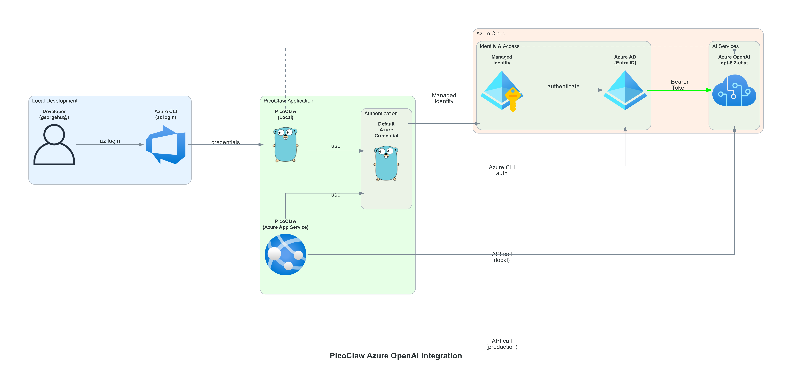
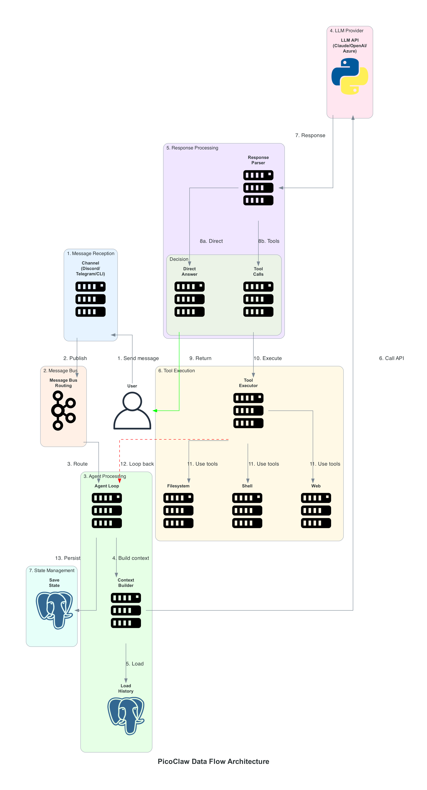

# PicoClaw Architecture Diagrams

**High-resolution PNG diagrams** for system architecture documentation.

---

## 📊 Available Diagrams

### 1. High-Level System Architecture

**File**: [`diagrams/picoclaw-high-level.png`](diagrams/picoclaw-high-level.png)

**Shows**:
- Client Layer (Discord, Telegram, Slack, CLI)
- Gateway Layer (Message Bus)
- Agent Core (Loop, Context Builder, Session Manager)
- Service Layer (Providers, Skills, Tools)
- Infrastructure Layer (State, Auth, Config)



**Use Case**: Executive presentations, system overview, documentation

---

### 2. Azure OpenAI Integration

**File**: [`diagrams/picoclaw-azure-integration.png`](diagrams/picoclaw-azure-integration.png)

**Shows**:
- Local development flow with Azure CLI
- Azure production flow with Managed Identity
- DefaultAzureCredential authentication
- Azure AD (Entra ID) integration
- Azure OpenAI API connection



**Use Case**: Azure deployment planning, security reviews, DevOps documentation

---

### 3. Data Flow Architecture

**File**: [`diagrams/picoclaw-data-flow.png`](diagrams/picoclaw-data-flow.png)

**Shows**:
- End-to-end message flow (13 steps)
- Message reception → Bus → Agent → LLM → Response
- Tool execution loop
- State management
- Decision points (Direct Answer vs Tool Calls)



**Use Case**: Developer onboarding, debugging, sequence understanding

---

### 4. Deployment Architecture

**File**: [`diagrams/picoclaw-deployment.png`](diagrams/picoclaw-deployment.png)

**Shows**:
- Local development setup
- Docker container deployment
- Azure cloud deployment options:
  - App Service
  - Virtual Machine
  - Container Instance
- Shared Azure services (Storage, Database, AI)
- Load balancer configuration


**Use Case**: Infrastructure planning, deployment guides, cost estimation

---

### 5. Provider Architecture

**File**: [`diagrams/picoclaw-providers.png`](diagrams/picoclaw-providers.png)

**Shows**:
- Provider abstraction interface
- Multiple provider implementations:
  - Anthropic (Claude)
  - OpenAI
  - Azure OpenAI
  - Gemini, DeepSeek, Groq
- Authentication methods per provider
- API connections


**Use Case**: Provider integration, authentication setup, API configuration

---

## 📐 Diagram Specifications

| Property | Value |
|----------|-------|
| **Format** | PNG (Portable Network Graphics) |
| **DPI** | 300 (High Resolution) |
| **Font** | Arial Bold |
| **Style** | Professional, enterprise-ready |
| **Background** | White |
| **Layout** | Orthogonal (clean right angles) |

---

## 🎨 Diagram Color Coding

| Color | Layer/Purpose |
|-------|---------------|
| **Light Blue** (#e6f3ff) | Client/External interfaces |
| **Light Orange** (#fff0e6) | Gateway/Middleware |
| **Light Green** (#e6ffe6) | Core application logic |
| **Light Pink** (#ffe6f0) | Services/APIs |
| **Light Purple** (#f0e6ff) | Infrastructure/Storage |
| **Light Yellow** (#fff9e6) | Tools/Utilities |

---

## 🔄 Updating Diagrams

To regenerate diagrams with updated information:

```bash
cd /Users/ghu/aiworker/picoclaw

# Run the diagram generation scripts
python3 scripts/generate-architecture-diagrams.py

# Or use the diagrams library directly
python3 << 'EOF'
from diagrams import Diagram, Cluster
# ... your diagram code
EOF
```

---

## 📦 Diagram Files

All diagrams are located in: `/Users/ghu/aiworker/picoclaw/docs/diagrams/`

```
docs/diagrams/
├── picoclaw-high-level.png         (888 KB) - System overview
├── picoclaw-azure-integration.png  (716 KB) - Azure integration
├── picoclaw-data-flow.png          (924 KB) - Message flow
├── picoclaw-deployment.png         (803 KB) - Deployment options
└── picoclaw-providers.png          (845 KB) - Provider architecture
```

**Total Size**: ~4.2 MB

---

## 📖 Related Documentation

- [System Architecture (Markdown)](../SYSTEM_ARCHITECTURE.md) - Detailed text documentation
- [Azure End-to-End Success](../AZURE_END_TO_END_SUCCESS.md) - Azure implementation
- [Azure Local Testing Guide](../AZURE_LOCAL_TESTING_GUIDE.md) - Local testing with Azure CLI
- [Implementation Complete](../IMPLEMENTATION_COMPLETE.md) - Implementation summary

---

## 🎯 Usage Recommendations

### For Presentations
- Use **High-Level Architecture** for executive briefings
- Use **Deployment Architecture** for infrastructure discussions
- Use **Azure Integration** for security and compliance reviews

### For Documentation
- Embed all diagrams in README or wiki
- Include **Data Flow** for developer guides
- Reference **Provider Architecture** in API documentation

### For Development
- Print **Data Flow** for debugging sessions
- Reference **Provider Architecture** when adding new providers
- Use **Deployment Architecture** for DevOps planning

---

## 🔧 Tools Used

- **diagrams** library (Python) - https://diagrams.mingrammer.com/
- **Graphviz** - Graph visualization
- **Azure Icons** - Official Microsoft Azure icons
- **Programming Icons** - Standard programming language icons

---

## ✨ Diagram Features

✅ **High Resolution** - 300 DPI for crisp printing
✅ **Professional Styling** - Bold fonts, clean layout
✅ **Color Coded** - Easy visual distinction between layers
✅ **Labeled Connections** - Clear data flow indicators
✅ **Cluster Grouping** - Logical component organization
✅ **Orthogonal Layout** - Professional, grid-aligned appearance

---

**Created**: February 15, 2026
**Tools**: Python diagrams library, Graphviz
**Status**: Production ready, high-resolution PNG files
